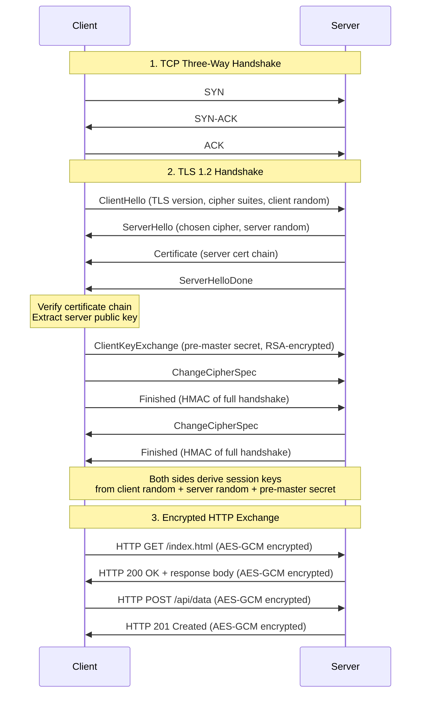

# HTTPS 交互流程

<callout emoji="bulb" background-color="light-blue">
标准 HTTPS 连接分三个阶段：**TCP 三次握手** → **TLS 1.2 握手** → **加密 HTTP 通信**。

握手完成后，所有 HTTP 内容均由协商的 `AES-GCM` 会话密钥加密传输，服务端证书在握手期间验证。
</callout>

